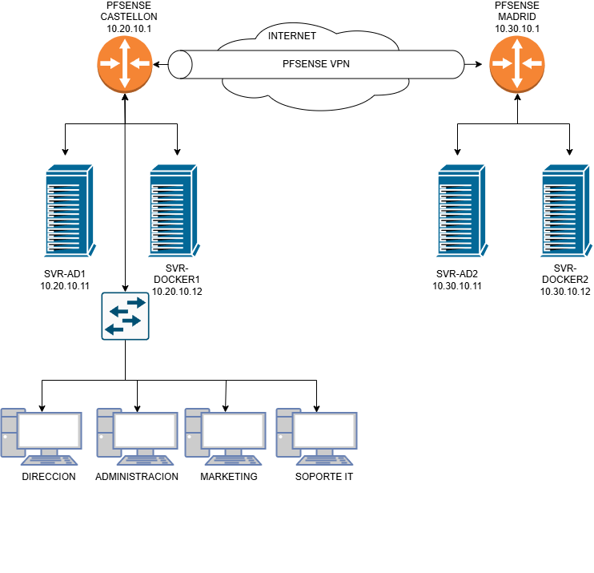

# Infraestructura de Red – Proyecto IPVCSI

## Estructura general

La red simula dos sedes conectadas mediante una VPN site-to-site:

- **Sede Castellón**: contiene los servidores principales, el controlador de dominio principal y el firewall pfSense.
- **Sede Madrid**: contiene los servidores de respaldo y un segundo firewall pfSense.

---

## Topología

> La imagen muestra los 4 servidores virtuales, 2 routers (pfSense), redes LAN separadas y el túnel VPN entre las sedes.

---

## Dispositivos e IPs asignadas

| Dispositivo             | IP             | Función                          | Sede        |
|-------------------------|----------------|----------------------------------|-------------|
| pfSense-Castellón (LAN) | `10.20.10.1`   | Firewall, DHCP, DNS forwarder    | Castellón   |
| srv-ad                  | `10.20.10.11`  | Controlador de dominio principal | Castellón   |
| srv-docker              | `10.20.10.12`  | Servicios en Docker              | Castellón   |
| pfSense-Madrid (LAN)    | `10.30.10.1`   | Firewall, cliente VPN            | Madrid      |
| srv-ad2                 | `10.30.10.21`  | Controlador de dominio secundario| Madrid      |
| srv-docker2             | `10.30.10.22`  | Replica de servicios Docker      | Madrid      |

**VPN túnel (WireGuard):**

- IP Castellón: `10.99.99.1`
- IP Madrid: `10.99.99.2`
- Rango del túnel: `10.99.99.0/24`
- Puerto utilizado: `51420/UDP`

---

## Segmentación de red

- Red interna sede Castellón: `10.20.10.0/24`
- Red interna sede Madrid: `10.30.10.0/24`
- Red VPN: `10.99.99.0/24`
- Red WAN (NAT VirtualBox): `10.0.0.0/16` *(usada como Internet simulada)*

---

## Servicios por sede

### Sede Castellón (nodo principal)

- Active Directory (srv-ad)
- DNS interno
- Nextcloud, Pi-hole, Plex, MySQL, Zabbix, Duplicati, Speedtest, Watchtower, WG-Easy (svr-docker)
- DHCP centralizado desde pfSense-Castellón

### Sede Madrid (respaldo funcional)

- Segundo controlador de dominio (srv-ad2)
- Réplica de servicios en Docker (srv-docker2)
- Servidor DHCP desactivado
- Acceso remoto por VPN

---

## Seguridad y configuración clave

- **VPN WireGuard** site-to-site: cifrado extremo a extremo
- **Firewall personalizado** en pfSense
- **Pi-hole** como filtro DNS interno
- **Backups automáticos** con Duplicati
- **Roles FSMO replicados** para alta disponibilidad de AD

---

## Pruebas realizadas

- Ping entre redes LAN de ambas sedes  
- Acceso a servicios desde Madrid mediante VPN  
- Fallo simulado de servidor principal (srv-ad / srv-docker) y continuidad desde respaldo  
- Sincronización de AD entre `srv-ad` y `srv-ad2`  
- Monitorización operativa con Zabbix

---

## Archivos relacionados

- `reglas.md`: reglas del firewall configuradas en ambos pfSense  
- `configuracion-vpn.md`: configuración detallada de WireGuard  
- `topologia-red.png`: imagen de la red completa

